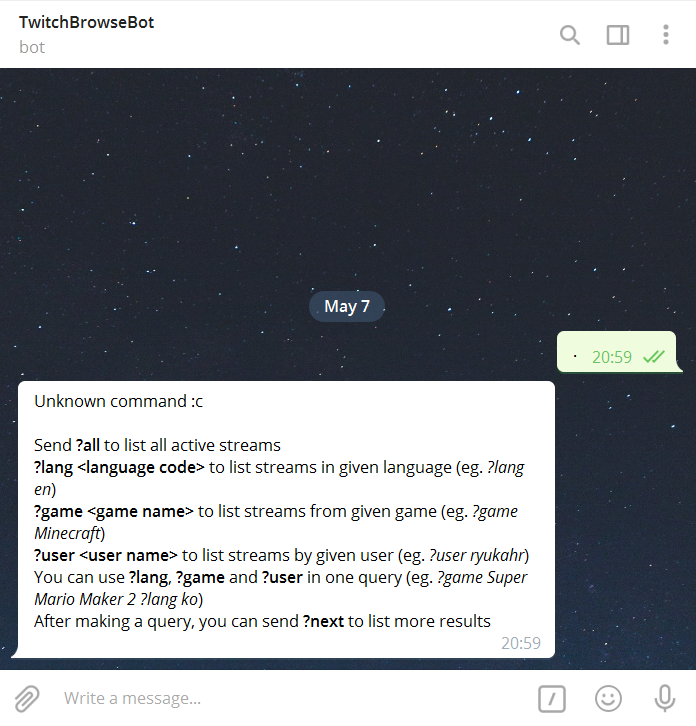
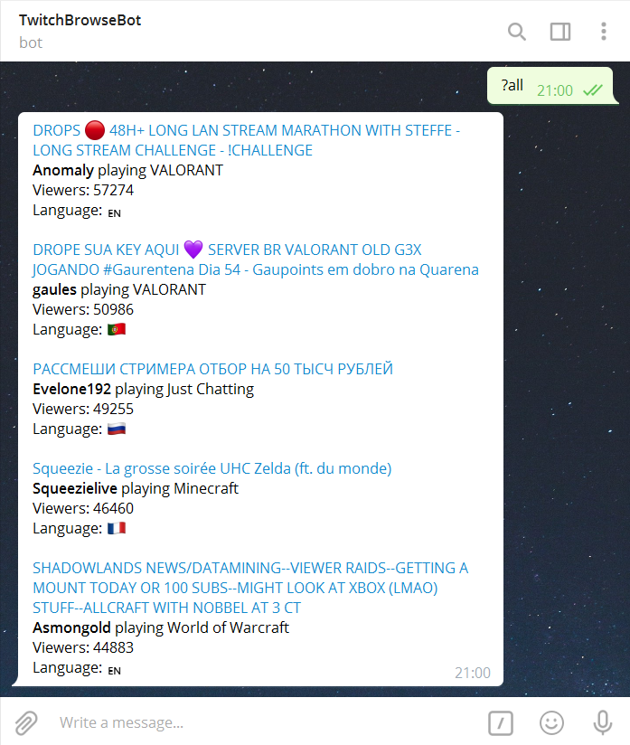
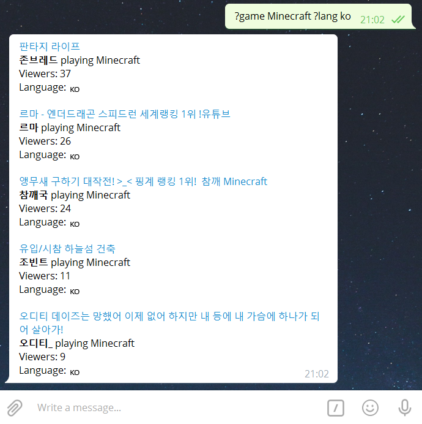
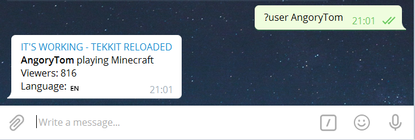
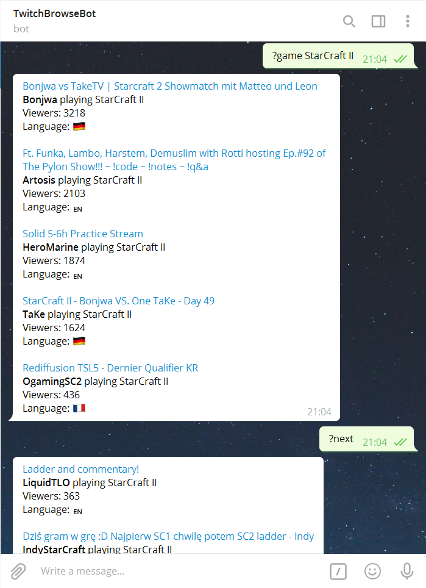

# Twitch Telegram Bot

A simple Telegram bot allowing to search for active Twitch streams, written in Java using Apache Camel framework. Project written as an assignment for Languages and tools for programming II course at MIM UW.

Screenshots
-----------

{:width="600px"}

